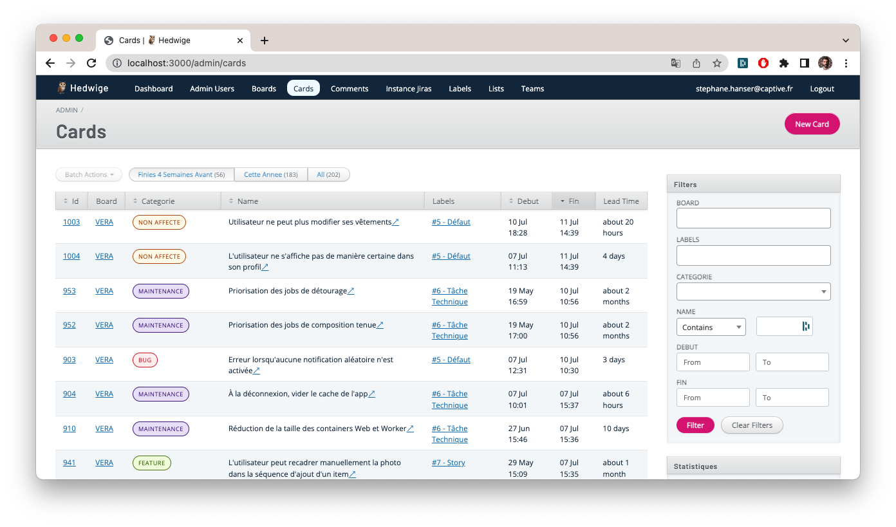

# CaptiveAdmin

[](https://opensource.org/licenses/MIT)
[](https://rubygems.org/gems/captive_admin)

A UI theme for ActiveAdmin that follows [Captive](https://captive.fr)'s Design System



## Installation

- Add this to you Gemfile:

```ruby
gem 'captive_admin'
```

- Run `bundle install`

- Edit `active_admin.scss` file
  - Remove these two lines
  ```scss
  @import "active_admin/mixins";
  @import "active_admin/base";
  ```
  - Replace with these two lines
  ```scss
  @import "captive_admin/mixins";
  @import "captive_admin/base";
  ```

## Contributing

Bug reports and pull requests are welcome on GitHub at https://github.com/Captive-Studio/captive_admin.

## License

The gem is available as open source under the terms of the [MIT License](https://opensource.org/licenses/MIT).
