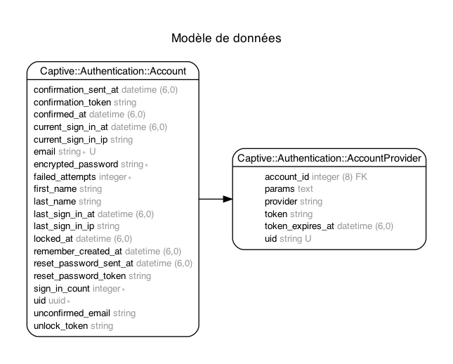

# captive-authentication

Devise authentication with email confirmations, password resets, and omniauth solutions

## Usage
How to use my plugin.

## Installation
Add this line to your application's Gemfile:

```ruby
gem "captive-authentication"
```

And then execute:
```bash
bundle install
rails captive_authentication:install:migrations # Copy the migrations into your application
rails db:migration
```

When all is setup, you can construct your user model into your application :

note : `user` is an example, you can use `admin` or all model name specify by your product owner

```ruby
create_table :users do |t|
  t.uuid :account_id

  ...
end

t.index :users, :account_id
```

```ruby
# frozen_string_literal: true

class User < ApplicationRecord
  belongs_to :account, class_name: 'Captive::Authentication::Account', primary_key: :uid
end
```

## Structure

A graph of the database structure can be generated in order to better understand the interactions between the different models.



To produce this graph:

```bash
$ cd spec/dummy
$ bundle exec rake erd
```

## Contributing
Contribution directions go here.

## License
The gem is available as open source under the terms of the [MIT License](https://opensource.org/licenses/MIT).
